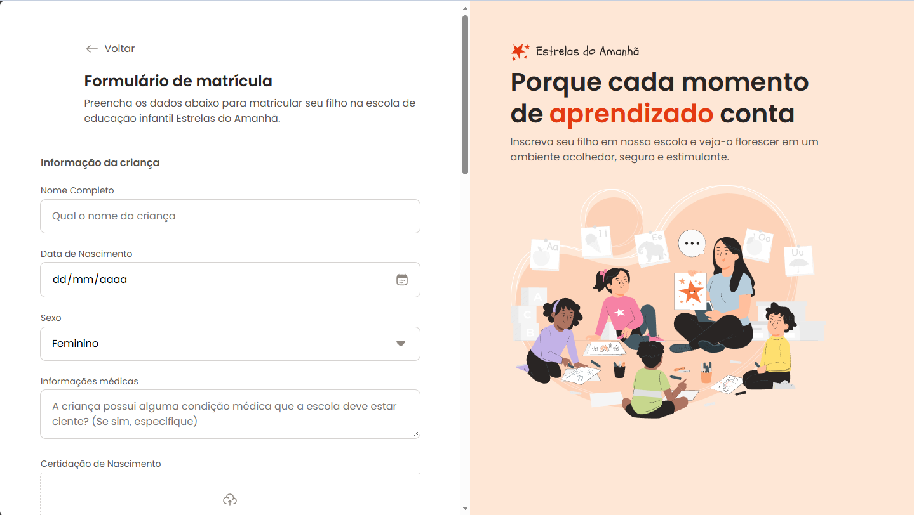
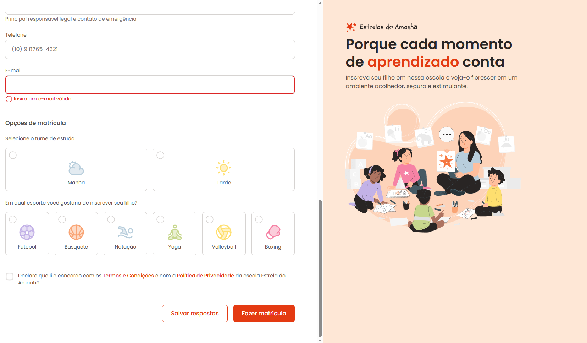

# Estrela do Amanhã (Star of Tomorrow)


One page registration form. Applying HTML form creation concepts.




### Link in Prod

https://form-estrela-do-amanha.vercel.app/

### Notes

1 - Layout Fix
*  Removed layout movement after focusing on inputs.
````css
input, textarea, select {
    /* remove icons default fields */
    appearance: none; 

    width: 100%;
    border-radius: .5rem;
    /* Grow the bord transparent. */
    border: 2px solid transparent;
    outline: 1px solid var(--stroke-default);

    padding: .75rem 1rem;

    font: var(--text);
}

input:focus, select:focus, textarea:focus, input[type="date"]:focus-within {
    /* Use outline property to change color border in focus */
    outline: .25rem solid var(--surface-secondary);
    border-color: var(--stroke-hightlight);

    /* To Safari browser */
    outline-offset: .1px;
}

````  

2 - Files CSS.
*   Global CSS - used variables.
````css
:root {
    --font-family: 'Poppins', sans-serif;
    --text: 400 1rem/1.5 var(--font-family);
    --text-sm: 400 0.875rem/1.4 var(--font-family);

    --text-primary: #292524;
    --text-secondary: #57534E;
    --text-tertiary: #8F8881;
    --text-highlight: #E43A12;

    --surface-primary: #FFFFFF;
    --surface-secondary: #FEE7D6;
    --surface-disabled: #E7E5E4;

    --stroke-default: #D6D3D1;
    --stroke-highlight: #F3541C;
    --semantic-error: #DC2626;
}
````

3 - Styles divided into components
````css
@import url(input.css);
@import url(droparea.css);
@import url(radio.css);
@import url(checkbox.css);
@import url(buttons.css);


````

4 - State checkbox onFocus, onChecked, default in CSS.
````css
.checkbox-wrapper {
    position: relative;

    & [type="checkbox"] {
        all: unset;
        position: absolute;
        inset: 0;
    }

    .checkbox-image {
        flex: 0 0 1.5rem;
        height: 1.5rem;

        background-image: url(../../assets/icons/checkbox-default.svg);
    }

    &:hover,
    &:focus-within {
        .checkbox-image {
            background-image: url(../../assets/icons/checkbox-hover.svg);
        }
    }

    &:has(:checked) .checkbox-image {
        background-image: url(../../assets/icons/checkbox-checked.svg);
    }
}
````

## Colaboradores
<table>
  <tr>
    <td align="center">
      <a href="#">
        <br>
        <sub>
          <b>Lázaro Pimentel</b>
        </sub>
      </a>
    </td>
  </tr>
</table>
